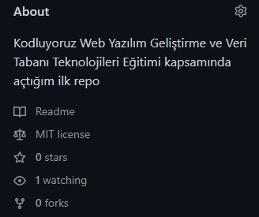

# Kodluyoruz Ilk Repo

Bu repo [Kodluyoruz](https://app.patika.dev/courses/git/odev1) Web Yazılım Geliştirme ve Veri Tabanı Teknolojileri Eğitiminde oluşturduğumuz ilk repo. İçerisinde bir adet README dosyası, bir adet de index.html barındırıyor.



## Installation

Öncelikle projeyi clonelayın. (Buraya sizin reponuzdan aldığınız link gelecek)

```
git clone https://github.com/dorukolcmener/kodluyoruzilkrepo
```

## Usage

Projeyi cloneladıktan sonra Visual Studio Code programında açınız.

Linux için:

```
cd kodluyoruzilkrepo
code .
```

## My patika.dev profile:

<a href="https://app.patika.dev/kaolin"></a>

## Contributing

Pull requestler kabul edilir. Büyük değişiklikler için, lütfen önce neyi değiştirmek istediğinizi tartışmak için bir konu açınız.

## License

[MIT](LICENSE)
